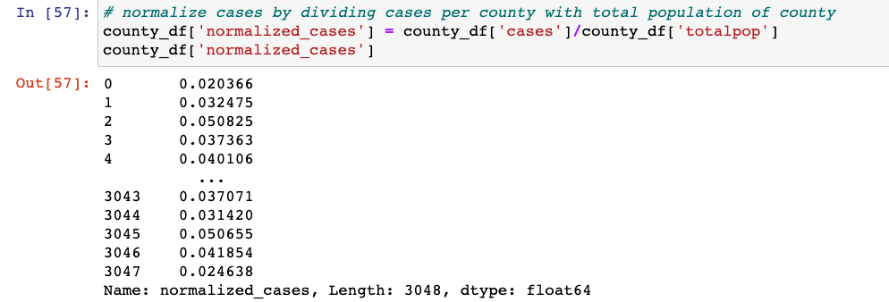
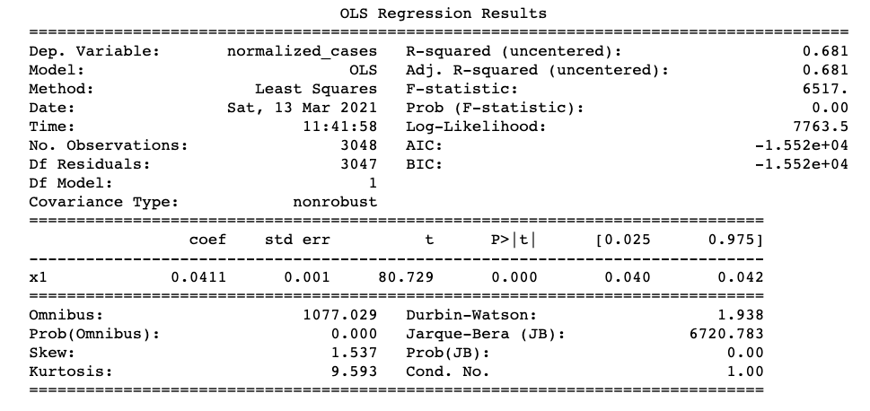
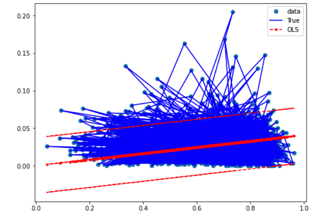
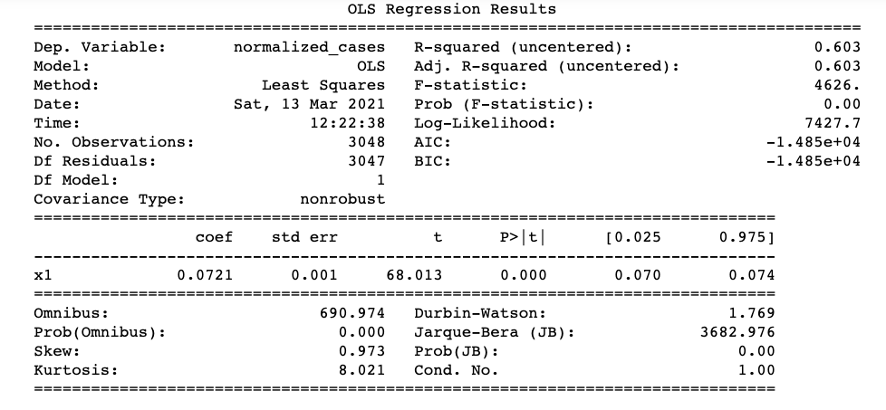
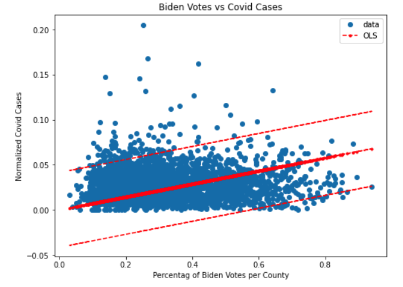
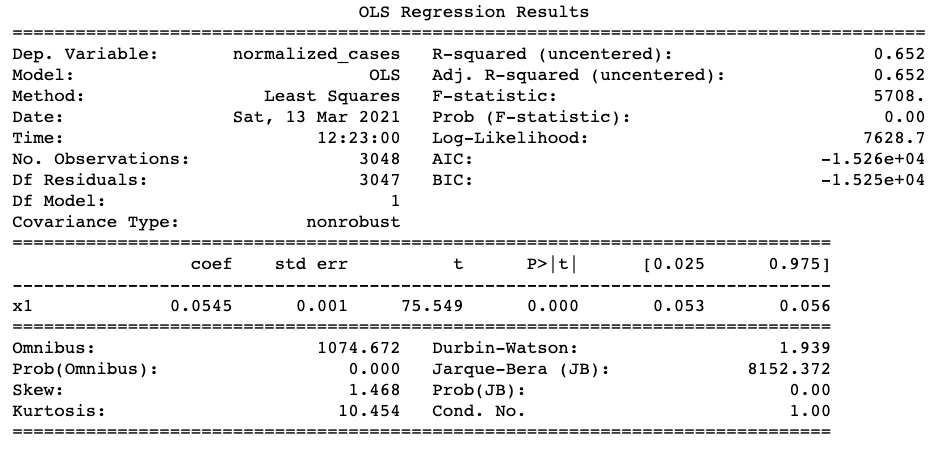
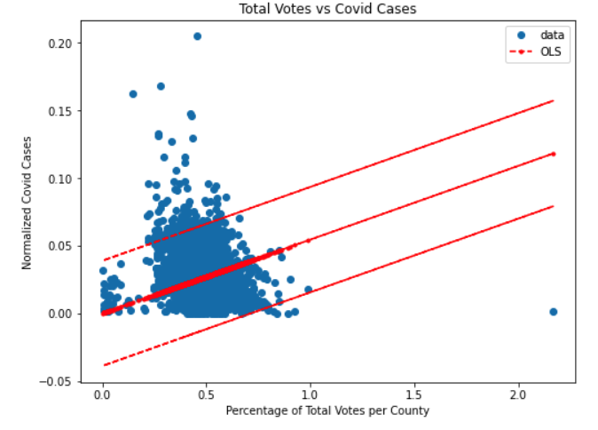
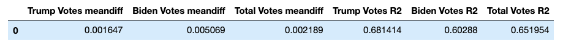
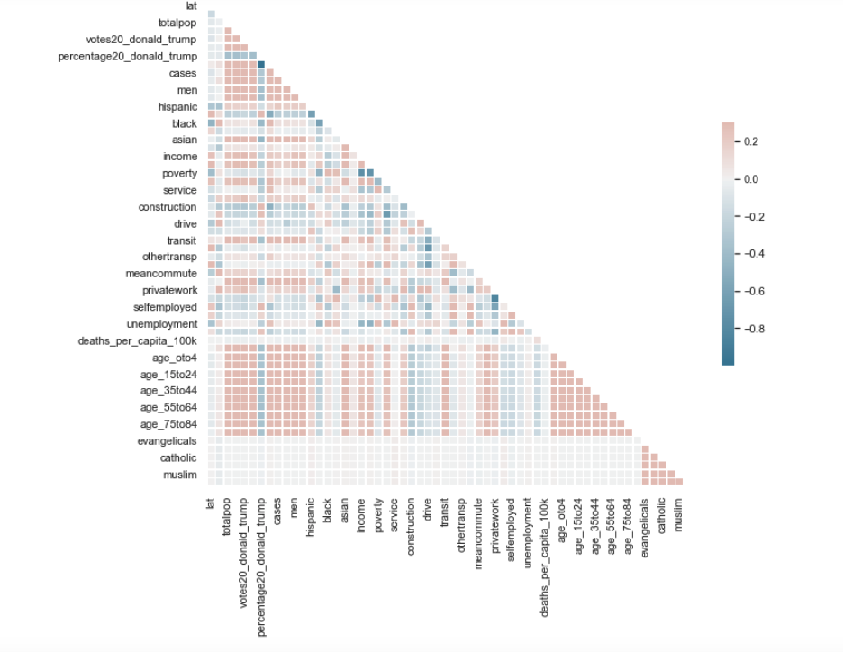
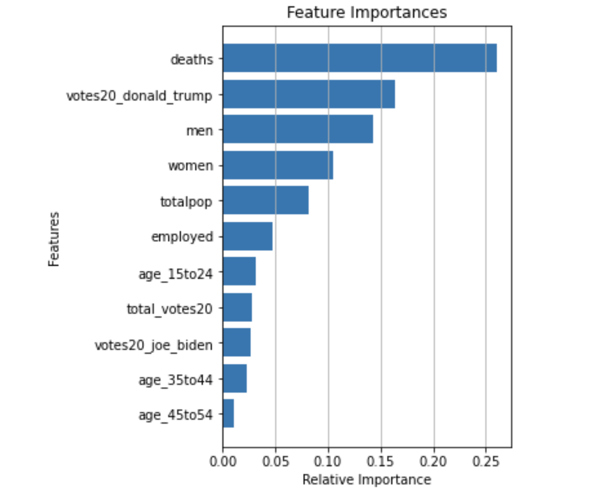

# Covid_and_Politics
Final Project for UC Berkeley Extension Bootcamp in Data Analytics (March 2021)

## Team Members in Alphabetical Order
 - Stephen Anayas-Hilliard
 - John Phillips
 - Melyssa Sibal
 - Isaac D. Tucker-Rasbury

## Overview
Using data acquired from multiple sources, we set out to discover if there are correlations with Covid 19 rates of infection and a group's political views, race or ethnicity, age, gender or economic status.  

To allow for the greatest possible diversity in our data, we drew our data from over 3000 counties in the United States. We retrieved our data on race, ethnicity, age, gender and economic status from the United States Census Bureau.  the Association of Statisticians of American Religious Bodies (ASARB) provided our data for the religious affiliations of a counties population.  We used statistics from kaggle for details on individual countie's Covid 19 rates of infections and death rates. 

## Purpose
To answer the question is there a correlation between Covid 19 transfer rates and a countie's population's political views, race or ethnicity make up, age, gender or economic status. 

## Project Breakdown
The project was broken down into four segments.
 - Segment One: 
   - Flesh out overall project
   - Build a model of our fabricated database
   - Build a simple model for machine learning.
     - Role Breakdown:
       - Stephen Anayas-Hilliard:  Responsible for repository, intitial data research and clean up.
       - John Phillips: Mockup of machine learning model.
       - Isaac D. Tucker-Rasbury: Mockup of sample database.
       - Melyssa Sibal: Technologies used in each step of project
  - Segment Two:
    - Refine our database
    - Train our model
    - Role Breakdown:
      - Stephen Anayas-Hilliard:  Responsible for respository,  back end clean up of data,  mock up Dashboard and Google Slides and breakdown of tools that will be used in our   dashboard.
      - John Phillips: Machine Learning Model
      - Isaac D. Tucker-Rasbury:  Took care of Database interface,  the table and joined all 4 of our original tables.
      - Melyssa Sibal: Continued with analysis and sample visuals.
  - Segment Three:
    - Connect final database to our model.
    - Continue to train our model
    - Create dashboard and presentation
    - Role Breakdown
      - Stephen Anayas-Hilliard: Creation of interactive dashboard.
      - John Phillips: Machine Learning Model
      - Isaac D. Tucker-Rasbury: Analysis on Economics vs Cases/Deaths.
      - Melyssa Sibal: Analysis on Races vs Cases/Deaths.
  - Segment Four:
    - Final touches on model, database and dashboard
  
## Resources
 - Data Source: 
   - [county Statistics](https://github.com/stephenanayashilliard/Covid_and_Politics/blob/main/Data/county_statistics.csv)
   - [U.S Religion Census Religious Congregations and Membership](https://github.com/stephenanayashilliard/Covid_and_Politics/blob/main/Data/U.S.%20Religion%20Census%20Religious%20Congregations%20and%20Membership%20Study%2C%202010%20(County%20File).csv)
   - [covid19_us_county.csv](https://github.com/stephenanayashilliard/Covid_and_Politics/blob/main/Data/covid19_us_county.csv)
   - [us_county_demographics.csv](https://github.com/stephenanayashilliard/Covid_and_Politics/blob/main/Data/us_county_demographics.csv)
   - [us-county_pop_and_shps.csv](https://github.com/stephenanayashilliard/Covid_and_Politics/blob/main/Data/us_county_pop_and_shps.csv)
- Software
  - Tableau for initial data exploration
  - R and RStudio
- Technologies
  - PostgresSQL 
  - AWS 
  - Jupyter Notebook
- Requirements List
  - PythonData 
- Languages
  - Python
    - Pandas: Used to create and clean DataFrames.
    - Numpy
- Tools
  - www.quickdatabaseddiagrams.com:  Used to flesh out our fabricated database
- Algorithms

## Database

In order to create the database, we needed to join the datasets detailing the following: a) covid cases and deaths, b) two tables with demographic data, and c) religion. Each table had county and state details that were leveraged to join the tables. Once the tables were joined, they were uploaded from the local server to an AWS S3 bucket to allow the team to access the database by using Pyspark and the object URL. 

- ### Amazon S3 Bucket for Data Storage

- ### Process
 - #### Part 1
    - From the intitial research, four csv files containing a total of 53 data points for 3049 counties was retrieved. Using Pandas, the four csv files were converted to dataframes then organized, data was converted to usuable numbers where needed and null values were converted to zeros.
    
  - #### Part 2
    - _Creating the Join Key_: To perform a join, there needs to be a field to join on. Unfortunately, we did not have one native to the data so one was created. A column was created to hold the key and then set the value equal to the result of county and state column data combined in each row. County data was then used as the primary table because it had the most results.
 
 
 
  - #### Part 3
      - _Joining in Parts_: To execute the join, the two tables were joined into interim tables, table_one. Then a third table was joined, creating a table_two. This process was repeated again to join the fourth table into the final database.

 - #### Part 4
      - _Troubleshooting Issues_: The fields that were null after the joins from part two needed to be filled in in order to not obstruct the upcoming machine learning model. The null values  were converted into zeros and the result saved.

## Machine Learning
   The goal of the machine learning aspect of this project is to predict if a county’s voting patterns in the 2020 election are correlated to covid transmission. Specifically, looking at the percentage of votes for Donald Trump and the percentage of votes for Joe Biden and the number of covid cases per county were used to make predictions. 
- ### Models Used
     - An Ordinary Least Squares (OLS) Model was used to analyze one independent variable at a time and its relation to the dependent variable- covid cases. A Random Forest Regressor (RFR) model was used to analyze multiple independent variables in relation to the dependent variable- covid cases. The OLS model was chosen for its ability to produce descriptive summary statistics and for its ability to be graphed using statsmodels packages. The RFR model was used for its ability to rank feature importances and for its compatibility with other sklearn packages such as RobustScaler, Principal Component Analysis (PCA), and Train, Test, Split.
- ### Scaling and Data Preprocessing
   - For the OLS model, a new column was created titled “normalized_cases” which was created by dividing the number of covid cases per county by the population of that county. This created a more usable variable because it more closely resembled the format of the percentage of votes for Trump and Biden columns. Because both of these columns contained numbers between 0 and 1, it behaved better in the OLS model. Below is an image of the calculation and creation of the normalized_cases column:

   - For the RFR model, the Robust Scaler was used because of its ability to handle outliers by using the interquartile range to scale the data. The “normalized_cases” column was not used in the RFR model to preserve the original data format for the correlation matrix and for the ranking of feature importance. For both models, the data was preprocessed by another team member to include religion and age metrics by county from other datasets. This was helpful for the correlation matrix and for the ranking of feature importance.
- #### Testing and Training
   - The OLS model did not require any testing or training of the data.
   - The RFR model was trained and tested using sklearn's Train, Test, Split package, which split the data into 70% training data and 30% testing data. The random state for the train and testing and the model was set to 48, as recommended by the sklearn docs.
- #### Targets and Features
   - For both models, the target was covid cases. The only difference is that the OLS model used the “normalized_cases” calculation and the RFR model used the raw covid cases per county data. The features for the OLS model were the percentage of votes for Donald Trump per county, percentage of votes for Joe Biden per county, and the total votes per county columns. 
   - For the RFR model, all usable features in the dataset were included. The latitude, longitude, county and state columns were excluded from the features because these columns would not benefit the analysis. The data was scaled using the Robust Scaler for its use of the interquartile range to handle the outliers in our dataset. It was decided that removing the outliers would negatively impact the analysis, because the outliers represented large cities that were critical for undertanding the relationship between social, economic, and political correlation to covid. 
- ### Limitations
  - The main limitation of the machine learning portion of this project is from the dataset. Because the dataset is based on a single moment in time, the linear model can not extrapolate the predictions into the future. If the dataset was organized in a time-series format that tracked the amount of covid cases over time, then this model could predict the amount of covid cases based on the time-series data. Further, the main drawback of the RFR model was its weakness in creating actionable insights. With no ability to create regression result statistics like the OLS model, the only insight into our question that could be gained from the RFR model was from the ranking of feature importance. 

## Dashboard
 - ### Process
   It was determined from the onset of the project that the dashboard for the project needed to be fully interactive and contain both information about processes for the    individual deliverables, as well as a written report about the analysis. For illustrative purposes, the dashboard allows the user to choose a county from a drop down menu.  From that choice illustrated graphs are created and depicted.
   - Depicted Graphs:
       - How the County Voted
       - Racial Demographics for the County
       - Unemployment Rates for the County
       - Occupation Demographics for the County
       - Age Demogrphics for the County

   - Storyboard: A storyboard was created to aid in the programming process.
     - [Google Slides of Dashboard  First Draft](https://docs.google.com/presentation/d/1pdmZe6_bEvOAb7rD1yRc64DmFuYZrB4FGuGW2Jl7vnw/edit?usp=sharing)

   - Dashboard Tools: The following tools were used to create the dashboard:
     - Bootstrap:  Used to create our responsive, front end.
     - D3.json:  Data format for sorting and presenting data
     - Potly:  Used to create dynamic charts to illustrated our findings.
     - Leaflet.js: Javascript Library used to build the heatmap portion of the Dashboard
     - GeoJSON: Used to create feature points for heatmap portion
     - Mapbox API: Used to pull our Maps for our heatmap portion.
   
## Analysis
 - ## Process 
Data was first explored through Tableau, which provided framework for further statistical analysis. This exploration looked at the number of cases in each county against 2020 presidential votes, age groups, racial groups, gender and income. 

It was later decided that R would be used to conduct statistical analysis on economic and racial demographics and its relationship to COVID cases and deaths. Machine learning was utilized to examine political voting behavior and COVID impacts. 

- ## Economics vs Cases/Deaths
This component of the overall analysis examines the relevance of the economic demographic variables to the strength of the overall Covid19 cases and deaths predicting model that we have endeavor to build here. While this analysis confirms the relevance of economic demographic variables with linear regression models, it leaves quantifying that relevance to the broader analysis in the machine learning section. To substantiate the relevance of the aforementioned variables, see the below for the p-values of the multi-variable linear regressions below with income, poverty rate, and unemployment rate as independent variables and Covid19 deaths and cases as dependent variables.

 

Here, the p-values establish the statistical significance of each variable. However, the R-squared values of both linear regressions can be interpreted as saying that these variables are very limited in their ability to alone predict Covid cases and deaths. Which brings us to a point where we should explore each of these variables.

##### Income
The average incomes per county represented in the databased are distributed around approximately $49k.

##### Poverty Rates 
The poverty rates in the database are predominantly distributed around 15% per county.

##### Unemployment Rates
The unemployment rates in the database are predominantly distributed around 6-7% per county.

- ## Race vs Cases/Deaths
This analysis examines the relationship of race and COVID-19 reported cases and deaths using RStudio to conduct statistical testing. The data explored comes from two separate sources. COVID reported cases and deaths are from this source from this time point, while racial demographics for each county are from this source from this timepoint. Insert methodology on how data was collected. Information on race for each county is presented in percentage of county population. As provided by the data source, race is defined into six categories: Asian, Black, Hispanic, Native, Pacific, and White.  

**Limitations**
- Timepoints of data collection
- Incomplete data or missing data due to US Census methodology
- Incomplete data or missing data due to inaccuracy of COVID reporting
- Racial categories are not broken out for further investigation

**Distribution of Racial Demographics within Counties**

Density plots for each racial category illustrate that populations are not normally distributed across the selected counties. Further, that racial groups are not equally represented within each county and within the entire dataset. For Asian, Black, Hispanic, Native, and Pacific populations, the data is right skewed. In contrast, white populations are left skewed. This shows that there is more data on counties with larger white populations. 

Shapiro tests for each racial category continue to support, in addition to visual assessments of the density plots, that the data is skewed. Because the calculated p-values are less than a significance level of 0.05, there is quantitative data to substainate that the data is not normally distributed. 

One-sample t-tests were conducted to compare if the distributions of race across sample counties were representative of national demographics. The national demographics were taken from the US Census from 2020 (https://www.census.gov/quickfacts/fact/table/US/RHI725219#RHI725219). While it could be assumed that the categories by the US Census align with the census county data, it should be noted that the methodologies of reporting race vary. It may be possible that people may have been recorded differently between the two points of data collection, and therefore, this comparison may not be accurate. Specifically, the US Census included categories "Two or more races", "White alone, not Hispanic or Latino", while the other dataset does not include those categories. 

With the assumption that the categories are, in fact, aligned, all p-values for each racial category from the one-sample t-tests are calculated under the 0.05 significance level. Therefore, there is sufficient evidence to reject the null hypothesis. There is a statistical difference between the means of each racial category and its national percentage, showing that racial representation differ at the county level. 

**Correlations Between Race and COVID Cases and Deaths**

Pearson correlation coefficients were calculated for each racial category against the number of COVID cases and deaths. Subsets of the data were filtered to remove counties that reported 0% populations of specific ethinicities. Calculating correlation coefficients with these subsets showed that correlations were generally weaker (albeit not by much) when counties that did not report citizens of specific racial categories were removed. It should be noted that there were no counties that reported 0% white. 

Racial categories against the number of deaths show relatively weak correlations than expected. Asian populations and number of deaths show the strongest correlation at 0.3866916 and 0.3816597 when populations with 0% Asian American citizens were removed. 

Racial categories against the number of COVID related deaths performed similarly for Pearson correlation coefficients. 

These coefficients for both the number of cases and deaths offer opposing ideas to other studies and reports. Specifically, from this data, the coefficient shows a negative correlation between COVID cases and Native populations. In contrast, the CDC has reported that cases in American Indian/Native Americans are 3.5 times that of non-Hispanic whites (https://www.cdc.gov/media/releases/2020/p0819-covid-19-impact-american-indian-alaska-native.html). Additionally, there are several reports that minority communities have been disproportionately impacted by COVID-19, however, these correlation coefficients do not substantiate those claims. 

- ### Machine Learning Analysis
This analysis is based on the OLS regression model described earlier in the readme under the "Machine Learning" section. The three factors used and their relation to covid were a county's percentage of votes for Trump in the 2020 election, a county's percentage of votes for Biden in the 2020 election, and a county's total votes in the 2020 election.

**Percentage of Trump Votes and Covid Cases (per county)**

The chart below shows the OLS summary statistcs for this analysis. Notably, the R-squared is 68% and the p-value is 0. This means that 68% of the covid cases are explained by a county's votes for Donald Trump, and that we can reject the null hypothesis that this relationship is due to random chance.

The graph below visualizes the distribution of the data and the regression line with confidence intervals.

**Percentage of Biden Votes and Covid Cases (per county)**

The chart below shows the OLS summary statistcs for this analysis. Notably, the R-squared is 60% and the p-value is 0. This means that 60% of the covid cases are explained by a county's votes for Joe Biden, and that we can reject the null hypothesis that this relationship is due to random chance.

The graph below visualizes the distribution of the data and the regression line with confidence intervals.

**Total Votes and Covid Cases (per county)**

The chart below shows the OLS summary statistcs for this analysis. Notably, the R-squared is 65% and the p-value is 0. This means that 65% of the covid cases are explained by a county's total votes, and that we can reject the null hypothesis that this relationship is due to random chance.

The graph below visualizes the distribution of the data and the regression line with confidence intervals.

**Model Efficacy: OLS Real Values vs Predictions and Mean Difference**

Another method for analyzing the regression results apart from the summary statistics is to compare the real values and the predicted values. This was done by creating a dataframe with the real values, predicted values, and the the difference between these values (by subtracting the real values from the predicted values). Next, the mean of these differences was calculated for each model and put into the dataframe below:

From this dataframe, we can conclude that the OLS model was able to best predict the amount of covid cases based on a county's percentage of votes for Donald Trump. However, there does appear to be a relationship between the R-squared value and the mean of the differences for each model's independent variable: the higher the R-squared, the lower the mean of differences is between the real values and the predicted values for each model's independent variable. From this, we can conclude that the ability of a linear regression model to explain the relationship between a dependent and an independent variable directly affects the ability of that model to make predictions.

**RFR Model Insights**

Below is a correlation matrix graph that indicates the correlation between all features in the dataset. This was useful in helping to determine the levels of correlation between features, most importantly between covid cases per county and everything else.

**RFR Ranking of Feature Importance**

One of the main benefits of the RFR model is its ability to rank the importance of features based on the target of covid cases per county. The graph below ranks the top 11 most important features used in the RFR model. This provides further insight into what characteristics have the greatest effect on covid cases per county.

**Analysis of Results**

Based on the above above information, there are several conclusions that can be made. First, the R-squared values are all within 60% to 68%, which tells us that this model only explains the relationship between covid cases and voting behavior to a certain extent. The p-values of 0 are a strong indicator that the relationship of this data is not due to random chance, and that there is a statistically significant relationship between voting behavior and covid cases.

The RFR model's ranking of feature importance and the correlation matrix both demonstrate that for voting behaviors, votes for Donald Trump seem to be most correlated to covid cases per county. However, the OLS model's coefficient for Trump votes is 0.0411, and the OLS model's coeffecient for Biden Votes is 0.0721. From this information, we can conclude that for every percentage increase in votes for Trump in a county, the amount of covid cases increases by roughly 4.1%; and for every percentage increase in votes for Biden in a county, the amount of covid cases increases roughly 7.2%. This finding can be explained by the fact that densely populated metropolitan areas typically vote for democrats while less populated rural areas typically vote for republicans. Covid cases are more easily transmissable in densely populated areas, which explains the higher coefficient for Biden votes. In essence, the density of populations is probably a stronger indicator of covid transmission than the voting habits of those areas.

### Summary

**Politics and Covid**

As mentioned above, the machine learning analyses suggests that out of the three per county features used - percentage of votes for Donald Trump, percentage of Votes for Joe Biden, and total votes per county, it appears that increases in covid cases were most correlated to votes for Joe Biden. This is contradicted by the ranking of feature importance by the RFR model. However, the RFR model's ranking of feature importance is based on the amount of votes per county rather than the percentage, which provides different insights into this analysis. This finding does help to answer the question we initially set out to answer by providing some evidence that the percentage of votes for Joe Biden is correlated with higher covid transmission, while the number of votes for Donald Trump is correlated higher with covid transmission. Further analysis would be needed to make a more conclusive decision.

### Recommendations for Future Analysis

- ### Machine Learning

An addition to this analysis that would prove incredibly beneficial would be to add a dataset that included time series data both before and after the 2020 election. Ideally, this time series data would provide the number of covid cases per county on a weekly or biweekly basis. This would improve the the machine learning model and other analyses by inputing data that is more suited for a regression analysis. Further, this time series data could predict the increase or decrease of covid cases per county using the preexisting demographic, economic, or voting data. This time series data set could be merged into our main table with covid cases per county, and could have dates as the columns with the number of covid cases per county as the row values. Another interesting study would be to find out why the RFR model ranked the votes for Donald Trump as the most important political feature. Further analysis could prove that Trump votes are more highly correlated to increases in covid transmission if the population density of the county was accounted for. This could be accomplished by dividing the amount of votes for each candidate per county by the square mileage of each county.
