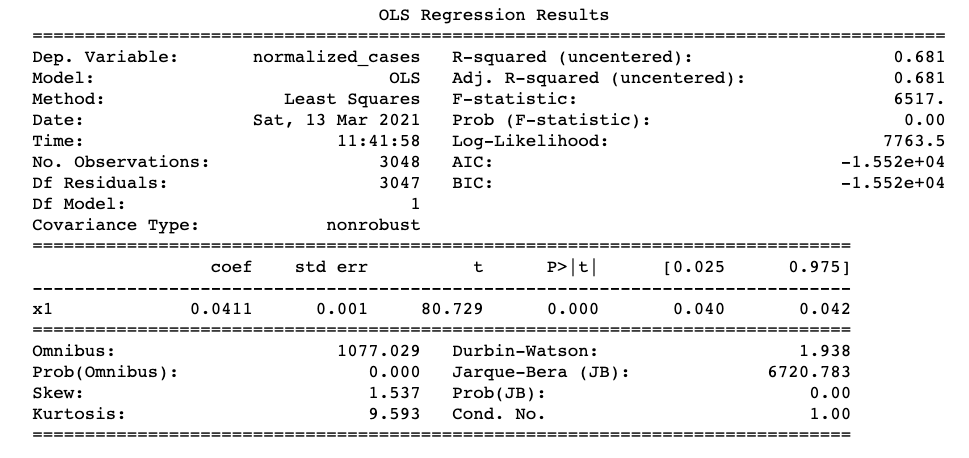
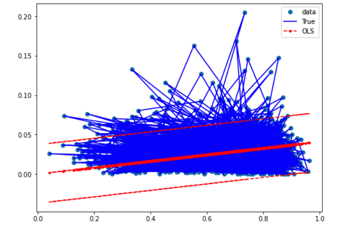
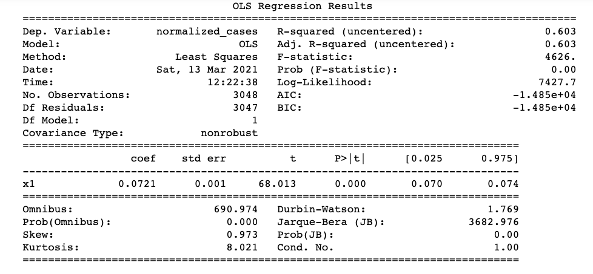
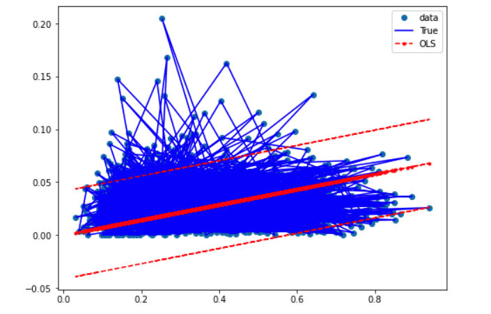
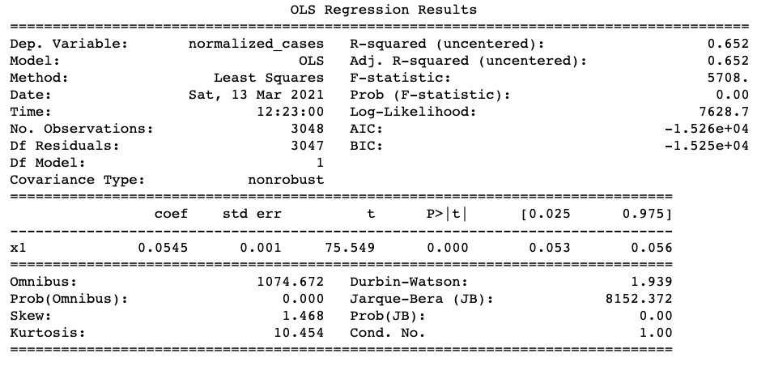
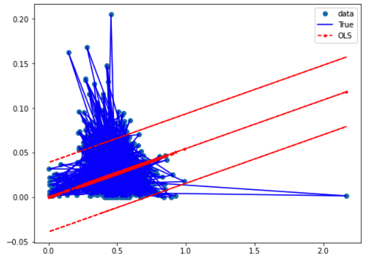

# Covid_and_Politics
Final Project for UC Berkeley Extension Bootcamp in Data Analytics (March 2021)

## Team Members in Alphabetical Order
 - Stephen Anayas-Hilliard
 - John Phillips
 - Melyssa Sibal
 - Isaac D. Tucker-Rasbury

## Overview
Using data acquired from multiple sources, we set out to discover if there are correlations with Covid 19 rates of infection and a group's political views, race or ethnicity, age, gender or economic status.  

To allow for the greatest possible diversity in our data, we drew our data from over 3000 counties in the United States. We retrieved our data on race, ethnicity, age, gender and economic status from the United States Census Bureau.  the Association of Statisticians of American Religious Bodies (ASARB) provided our data for the religious affiliations of a counties population.  We used statistics from kaggle for details on individual countie's Covid 19 rates of infections and death rates. 

## Purpose
To answer the question is there a correlation between Covid 19 transfer rates and a countie's population's political views, race or ethnicity make up, age, gender or economic status. 

## Project Breakdown
The project was broken down into four segments.
 - Segment One: 
   - Flesh out overall project
   - Build a model of our fabricated database
   - Build a simple model for machine learning.
     - Role Breakdown:
       - Stephen Anayas-Hilliard:  Responsible for repository, intitial data research and clean up.
       - John Phillips: Mockup of machine learning model.
       - Isaac D. Tucker-Rasbury: Mockup of sample database.
       - Melyssa Sibal: Technologies used in each step of project
  - Segment Two:
    - Refine our database
    - Train our model
    - Role Breakdown:
      - Stephen Anayas-Hilliard:  Responsible for respository,  back end clean up of data,  mock up Dashboard and Google Slides and breakdown of tools that will be used in our   dashboard.
      - John Phillips: Machine Learning Model
      - Isaac D. Tucker-Rasbury:  Took care of Database interface,  the table and joined all 4 of our original tables.
      - Melyssa Sibal: Continued with analysis and sample visuals.
  - Segment Three:
    - Connect final database to our model.
    - Continue to train our model
    - Create dashboard and presentation
    - Role Breakdown
      - Stephen Anayas-Hilliard: Creation of interactive dashboard.
      - John Phillips: Machine Learning Model
      - Isaac D. Tucker-Rasbury: Analysis on Economics vs Cases/Deaths.
      - Melyssa Sibal: Analysis on Races vs Cases/Deaths.
  - Segment Four:
    - Final touches on model, database and dashboard
  
## Resources
 - Data Source: 
   - [county Statistics](https://github.com/stephenanayashilliard/Covid_and_Politics/blob/main/Data/county_statistics.csv)
   - [U.S Religion Census Religious Congregations and Membership](https://github.com/stephenanayashilliard/Covid_and_Politics/blob/main/Data/U.S.%20Religion%20Census%20Religious%20Congregations%20and%20Membership%20Study%2C%202010%20(County%20File).csv)
   - [covid19_us_county.csv](https://github.com/stephenanayashilliard/Covid_and_Politics/blob/main/Data/covid19_us_county.csv)
   - [us_county_demographics.csv](https://github.com/stephenanayashilliard/Covid_and_Politics/blob/main/Data/us_county_demographics.csv)
   - [us-county_pop_and_shps.csv](https://github.com/stephenanayashilliard/Covid_and_Politics/blob/main/Data/us_county_pop_and_shps.csv)
- Software:
- Technologies
- Requirements List
  - PythonData 
- Languages
  - Python
    - Pandas: Used to create and clean DataFrames.
    - Numpy 
- Tools
  - www.quickdatabaseddiagrams.com:  Used to flesh out our fabricated database
- Algorithms

## Database

In order to create the database, We needed to join the datasets detailing the following: a) covid cases and deaths, b) two tables with demographic data, and c) religion. Each table had county and state details as well that were leveraged to join the tables. Once the tables were joined, they were uploaded from the database to an AWS S3 bucket to allow  access the database  by using Pyspark and the object URL. 

- ### Process
  - #### Part 1
    From the intitial research, four csv files containing a total of 53 data points for 3049 counties was retrieved. Using Pandas, the four csv files were converted to dataframes then organized, data was converted to usuable numbers where needed and null values were converted to zeros.
  - #### Part 2
      - _Creating the Join Key_: To perform a join, there needs to be a field to join on. Unfortunately, we did not have one native to the data so one was created. A column was created to hold the key and then set the value equal to the result of county and state column data combined in each row. County data was then used as the primary table because it had the most results.
      - _Joining in Parts_: To execute the join, the two tables were joined into an interim table, table_one, and then a third table was joined, creating a table_two. This process was repeated again to join the  fourth table into the final database.
      - _Troubleshooting Issues_: The fields that were null after the joins from part two needed to be filled in in order to not obstruct the upcoming machine learning model. The null values  were converted into zeros and the result saved.

## Machine Learning
   The goal of the machine learning aspect of this project is to predict if a county’s voting patterns in the 2020 election are correlated to covid transmission. Specifically, looking at the percentage of votes for Donald Trump and the percentage of votes for Joe Biden and the number of covid cases per county were used to make predictions. 
- ### Models Used
     - An Ordinary Least Squares (OLS) Model was used to analyze one independent variable at a time and its relation to the dependent variable- covid cases. A Random Forest Regressor (RFR) model was used to analyze multiple independent variables in relation to the dependent variable- covid cases. The OLS model was chosen for its ability to produce descriptive summary statistics and for its ability to be graphed using statsmodels packages. The RFR model was used for its ability to rank feature importances and for its compatibility with other sklearn packages such as RobustScaler, Principal Component Analysis (PCA), and Train, Test, Split.
- ### Scaling and Data Preprocessing
   - For the OLS model, a new column was created titled “normalized_cases” which was created by dividing the number of covid cases per county by the population of that county. This created a more usable variable because it more closely resembled the format of the percentage of votes for Trump and Biden columns. Because both of these columns contained numbers between 0 and 1, it behaved better in the OLS model.

   - For the RFR model, the Robust Scaler was used because of its ability to handle outliers by using the interquartile range to scale the data. The “normalized_cases” column was not used in the RFR model to preserve the original data format for the correlation matrix and for the ranking of feature importance. For both models, the data was preprocessed by another team member to include religion and age metrics by county from other datasets. This was helpful for the correlation matrix and for the ranking of feature importance. 
- #### Targets and Features
   - For both models, the target was covid cases. The only difference is that the OLS model used the “normalized_cases” calculation and the RFR model used the raw covid cases per county data. The features for the OLS model were the percentage of votes for Donald Trump per county, percentage of votes for Joe Biden per county, and the total votes per county columns. 
   - For the RFR model, the feature columns were divided into three categories: economic data, ethnicity data, and political data. PCA was used to reduce the dimensions of the grouped datasets to two dimensions before training, testing, and splitting the data for the model. Using PCA for the multivariate RFR model made graphing the findings easier and was useful for grouping multiple columns into two components based on the distribution and variance of the data.
- ### Limitations
  - The main limitation of the machine learning portion of this project is from the dataset. Because the dataset is based on a single moment in time, the linear model can not extrapolate the predictions into the future. If the dataset was organized in a time-series format that tracked the amount of covid cases over time, then this model could predict the amount of covid cases based on the time-series data. 

## Dashboard
 - ### Process
   It was determined from the onset of the project that the dashboard for the project needed to be fully interactive and contain both information about processes for the    individual deliverables, as well as a written report about the analysis. For illustrative purposes, the dashboard allows the user to choose a county from a drop down menu.  From that choice illustrated graphs are created and depicted.
   - Depicted Graphs:
       - How the County Voted
       - Racial Demographics for the County
       - Unemployment Rates for the County
       - Occupation Demographics for the County
       - Age Demogrphics for the County

   - Storyboard: A storyboard was created to aid in the programming process.
     - [Google Slides of Dashboard  First Draft](https://docs.google.com/presentation/d/1pdmZe6_bEvOAb7rD1yRc64DmFuYZrB4FGuGW2Jl7vnw/edit?usp=sharing)

   - Dashboard Tools: The following tools were used to create the dashboard:
     - Bootstrap:  Used to create our responsive, front end.
     - D3.json:  Data format for sorting and presenting data
     - Potly:  Used to create dynamic charts to illustrated our findings.
     - Leaflet.js: Javascript Library used to build the heatmap portion of the Dashboard
     - GeoJSON: Used to create feature points for heatmap portion
     - Mapbox API: Used to pull our Maps for our heatmap portion.
   

## Analysis
To be filled in future deliverables 

 - ### Results of Melyssa's Analysis
This section of the project explores the data through Tableau, which will provide some framework for further statistical analysis. 

**Total Cases by State** 

The above bar graph shows the total number of cases per state. While this image gives some information on the number of cases reported within each state, further analysis could provide insight into how the number of cases fits within the total population. This comparison of states does not consider population size. An additional comparison of population per square mile would also be interesting to examine. 

**Cases vs. Voting Count/Percentage**

The scatter plot illustrates the number of votes for Joe Biden or Donald Trump during the 2020 Presidental Election against the number of cases by county. While this provides a comparison between votes, it does not provide information within the context of total votes.   

The scatter plot shows the percentage of total votes for each presidential candidate against the number of cases by county. 

While both plots explore a connection between presidental votes and reported COVID-19 cases, it is difficult to understand if there is a correlation given the clustering effect that can be seen. Further analysis may be conducted to provide insight into a relationship, if any.  

**Cases vs. Age Groups** 

The graph plots the population percent within given age brackets against number of cases per county. 

Due to the low percentages of age groups on opposite sides of the age range, the above graph combines age groups, which may be reconsidered for additional analysis. 

Again, the effect of age on reported cases may be explored further. 

**Cases vs. Racial Groups** 

The scatter plot disaggregates the country population by race against the number of reported COVID cases. Race in this graph is reported by the population percentage. Again, from this initial analysis, it is difficult to interpret what effect race has on COVID infection, if any. 

**Cases vs. Median Income**

Median income for counties is plotted against number of cases. Further analysis could examine the difference between median income and income per capita and if either influence reported COVID cases. 

**Cases vs. Gender Percentage**

Population by gender is shown in relation to the number of COVID cases. Gender is reported in percentage of the county population. Similarly to the other graphs, it is difficult to see a clear correlation. 

**Cases Heat Map**

Latitude and longitudes for each county is plotted with the color of each point relating to the number of reported COVID cases. Darker points have relatively more COVID cases, which is defined in the legend. It would be interesting to explore in further depth where the hot spots are and if there are any similarities between the counties in terms of the factors previously mentioned.  

**Cases vs. Religion**

This factor was not included in the machine learning portion, but data on religion is available for the counties included in this project. Religion was grouped into six categories and is plotted as the population percentage of the county against the number of COVID reported cases. Again, further analysis could be conducted to provide further insight. 

- ## Economics vs Cases/Deaths
For future deliverables

- ## Race vs Cases/Deaths
This analysis examines the relationship of race and COVID-19 reported cases and death using RStudio to conduct statistical testing. The data explored comes from two separate sources. COVID reported cases and deaths are from this source from this time point, while racial demographics for each country are from this source from this timepoint. Insert methodology on how data was collected. Information on race for each county is provided in percentage of population. Race was defined into six categories: Asian, Black, Hispanic, Native, Pacific, and White. 

**Limitations**
- Timepoints of data collection
- Incomplete data or missing data due to US Census methodology
- Incomplete data or missing data due to inaccuracy of COVID reporting
- Racial categories are not broken out for further investigation

**Distribution of Racial Demographics within Counties**

Density plots for each racial category illustrate that populations are not normally distributed across the selected counties. Further, that racial groups are not equally represented within each county and within the entire dataset. For Asian, Black, Hispanic, Native, and Pacific populations, the data is right skewed. In contrast, white populations are left skewed. This shows that there is more data on counties with larger white populations. 

Shapiro tests for each racial category continue to support, in addition to visual assessments of the density plots, that the data is skewed. Because the calculated p-values are less than a significance level of 0.05, there is quantitative data to substainate that the data is not normally distributed. 

One-sample t-tests were conducted to commpare the distributions of race across counties was representative of the national demographics. The national demographics were taken from the US Census from 2020 (https://www.census.gov/quickfacts/fact/table/US/RHI725219#RHI725219). While it could be assumed that the categories by the US Census align with the census county data, it should be noted that the methodologies of reporting vary. It may be possible that people may have been recorded differently and therefore, the comparison in its totality may not be accurate. Specifically, the US Census included categories "Two or more races", "White alone, not Hispanic or Latino", while the other data does not include those categories. 

In the assumption that the categories are aligned, p-values from the one-sample t-tests are calculated under the 0.05 significance level. Therefore, county populations cannnot be generalized to the national level. 

White and Native populations come close to a p-value of 0.05.

- ### Results of John's Machine Learning Analysis
This analysis is based on the OLS regression model described earlier in the readme under the "Machine Learning" section. The three factors used and their relation to covid were a county's percentage of votes for Trump in the 2020 election, a county's percentage of votes for Biden in the 2020 election, and a county's total votes in the 2020 election.

**Percentage of Trump Votes and Covid Cases (per county)**

The chart below shows the OLS summary statistcs for this analysis. Notably, the R-squared is 68% and the p-value is 0. This means that 68% of the covid cases are explained by a county's votes for Donald Trump, and that we can reject the null hypothesis that this relationship is due to random chance.

The graph below visualizes the distribution of the data and the regression line with confidence intervals.

**Percentage of Biden Votes and Covid Cases (per county)**

The chart below shows the OLS summary statistcs for this analysis. Notably, the R-squared is 60% and the p-value is 0. This means that 60% of the covid cases are explained by a county's votes for Joe Biden, and that we can reject the null hypothesis that this relationship is due to random chance.

The graph below visualizes the distribution of the data and the regression line with confidence intervals.

**Total Votes and Covid Cases (per county)**

The chart below shows the OLS summary statistcs for this analysis. Notably, the R-squared is 65% and the p-value is 0. This means that 65% of the covid cases are explained by a county's total votes, and that we can reject the null hypothesis that this relationship is due to random chance.

The graph below visualizes the distribution of the data and the regression line with confidence intervals.

**OLS Real Values vs Predictions and Mean Difference**

Another method for analyzing the regression results apart from the summary statistics is to compare the real values and the predicted values. This was done by creating a dataframe with the real values, predicted values, and the the difference between these values (by subtracting the real values from the predicted values). Next, the mean of these differences was calculated for each model and put into the dataframe below:

From this dataframe, we can conclude that the OLS model was able to best predict the amount of covid cases based on a county's percentage of votes for Donald Trump. However, there does appear to be a relationship between the R-squared value and the mean of the differences for each model's independent variable: the higher the R-squared, the lower the mean of differences is between the real values and the predicted values for each model's independent variable. From this, we can conclude that the ability of a linear regression model to explain the relationship between a dependent and an independent variable directly affects the ability of that model to make predictions. 

**Analysis of Results**

Based on the above above information, there are several conclusions that can be made. First, the R-squared values are all within 60% to 68%, which tells us that this model only explains the relationship between covid cases and voting behavior to a certain extent. The p-values of 0 are a strong indicator that the relationship of this data is not due to random chance, and that there is a statistically significant relationship between voting behavior and covid cases.

### Summary
To be filled in future deliverables
