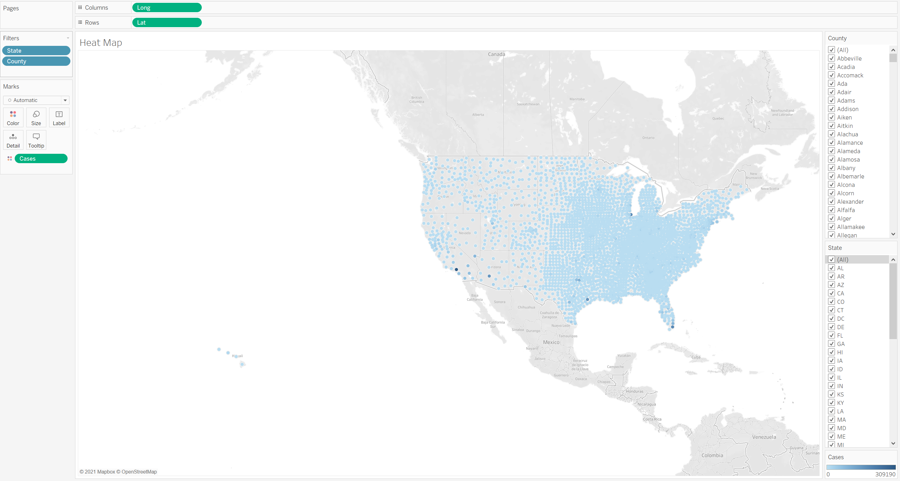
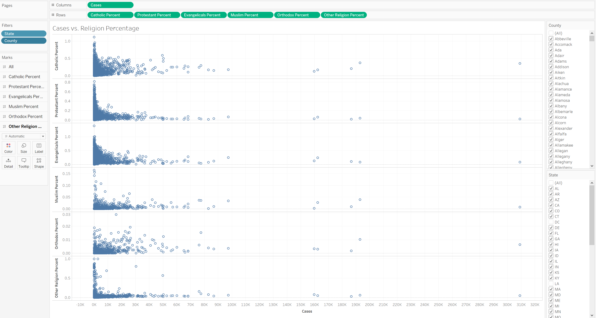

# Outline of Project 
This project will examine county-specific data across all 50 states in the US. These data have been extracted from various sources and include demographic information on age, race, gender, and votes from the 2020 presidental election, as well as COVID-19 infection rates. While these data are extensive, it is important to note that the data was collected at a specific point in time, and therefore, does not account for changes that may have occurred. 

Overall, this project aims to answer if there are correlations between infection rates of COVID-19 and a county's voting behavior or demographics, specifically, age, gender or economic status. 

# Initial Analysis 
This section of the project explores the data through Tableau, which will provide some framework for further statistical analysis. 

**Total Cases by State** 

The above bar graph shows the total number of cases per state. While this image gives some information on the number of cases reported within each state, further analysis could provide insight into how the number of cases fits within the total population. This comparison of states does not consider population size. An additional comparison of population per square mile would also be interesting to examine. 

**Cases vs. Voting Count/Percentage**

The scatter plot illustrates the number of votes for Joe Biden or Donald Trump during the 2020 Presidental Election against the number of cases by county. While this provides a comparison between votes, it does not provide information within the context of total votes.   

The scatter plot shows the percentage of total votes for each presidential candidate against the number of cases by county. 

While both plots explore a connection between presidental votes and reported COVID-19 cases, it is difficult to understand if there is a correlation given the clustering effect that can be seen. Further analysis may be conducted to provide insight into a relationship, if any.  

**Cases vs. Age Groups** 

The graph plots the population percent within given age brackets against number of cases per county. 

Due to the low percentages of age groups on opposite sides of the age range, the above graph combines age groups, which may be reconsidered for additional analysis. 

Again, the effect of age on reported cases may be explored further. 

**Cases vs. Racial Groups** 

The scatter plot disaggregates the country population by race against the number of reported COVID cases. Race in this graph is reported by the population percentage. Again, from this initial analysis, it is difficult to interpret what effect race has on COVID infection, if any. 

**Cases vs. Median Income**

Median income for counties is plotted against number of cases. Further analysis could examine the difference between median income and income per capita and if either influence reported COVID cases. 

**Cases vs. Gender Percentage**

Population by gender is shown in relation to the number of COVID cases. Gender is reported in percentage of the county population. Similarly to the other graphs, it is difficult to see a clear correlation. 

**Cases Heat Map**

Latitude and longitudes for each county is plotted with the color of each point relating to the number of reported COVID cases. Darker points have relatively more COVID cases, which is defined in the legend. It would be interesting to explore in further depth where the hot spots are and if there are any similarities between the counties in terms of the factors previously mentioned.  

**Cases vs. Religion**

This factor was not included in the machine learning portion, but data on religion is available for the counties included in this project. Religion was grouped into six categories and is plotted as the population percentage of the county against the number of COVID reported cases. Again, further analysis could be conducted to provide further insight. 